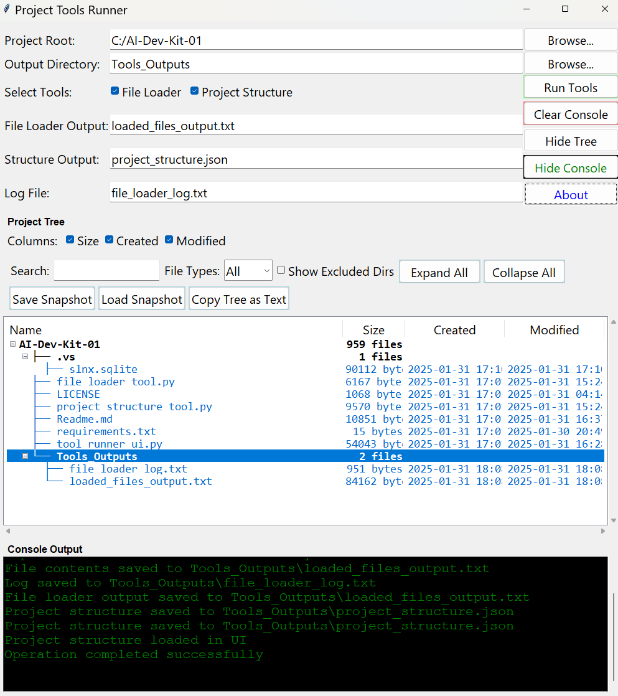
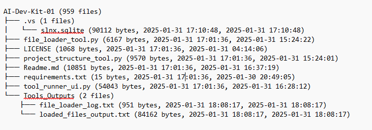
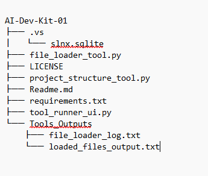
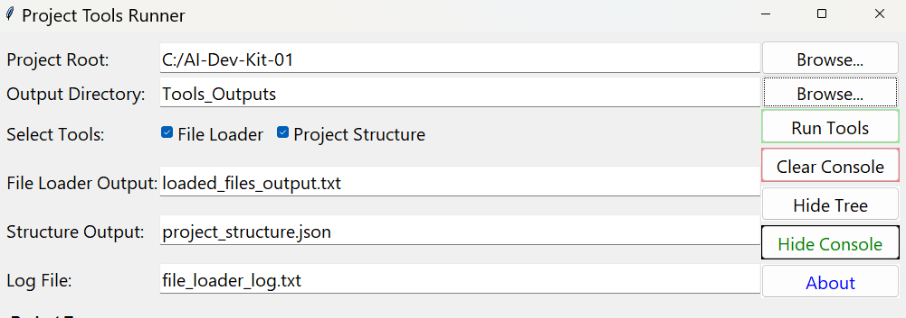
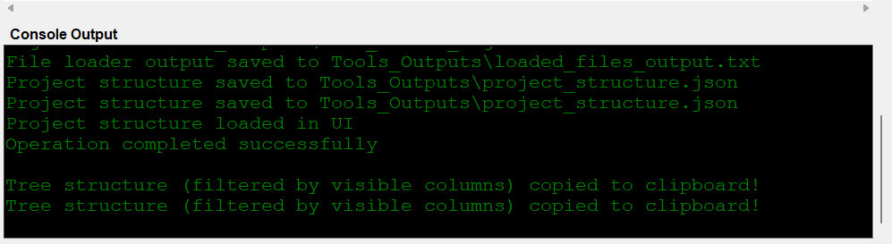
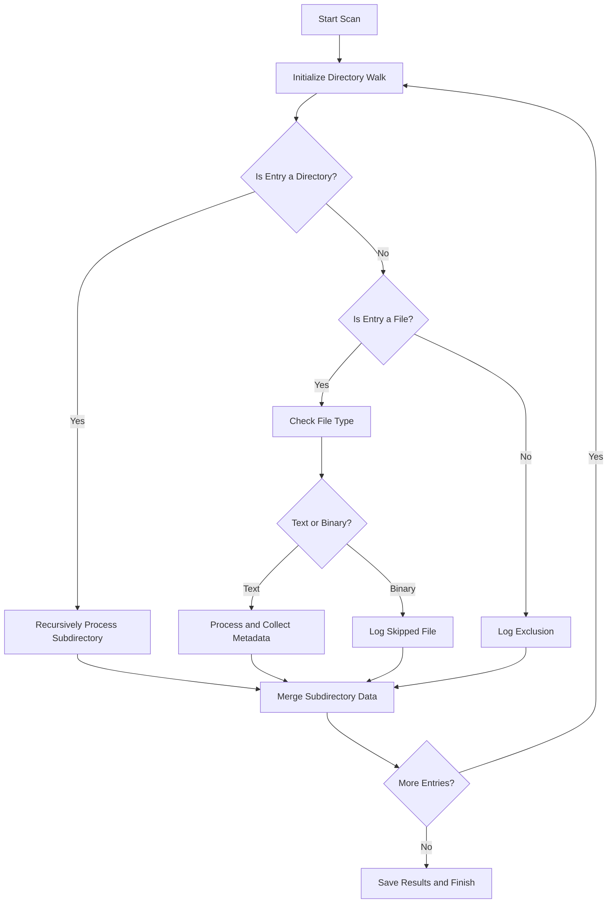
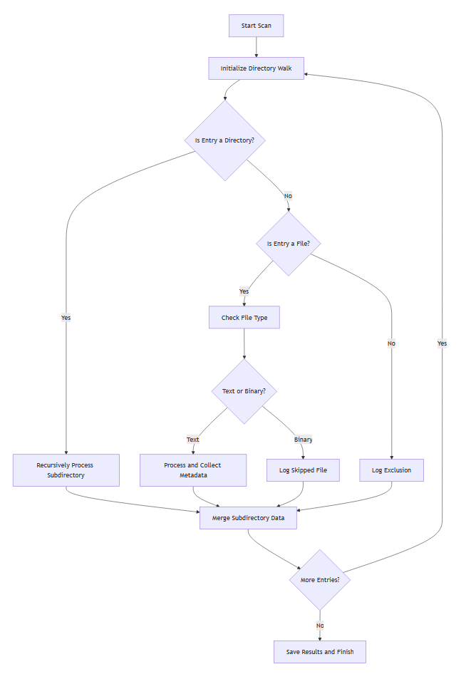

# Project Tools Runner

**Project Tools Runner** is a versatile Tkinter-based desktop application for developers, technical writers, and project managers to streamline project management, analysis, and sharing. It offers a clean, intuitive interface to:

1. **Concatenate Project Files**: Combine all text-based files in your project into a single `.txt` file for easy sharing, backups, or AI code reviews.
2. **Visualize Project Structure**: Map your directory structure into an interactive, multi-column tree view enriched with file metadata like size, creation date, and last-modified date.
3. **Analyze Projects**: Get detailed insights with folder counts, metadata, and advanced filtering options to explore and document your project effortlessly.

This tool is perfect for organizing large codebases, generating documentation, and preparing projects for AI-assisted workflows.

---

## Table of Contents

- [Key Features](#key-features)
- [Installation](#installation)
- [Quick Start](#quick-start)
- [Usage Guide](#usage-guide)
  - [Main Interface](#main-interface)
  - [Project Tree Views](#project-tree-views)
  - [Settings and Controls](#settings-and-controls)
  - [Output Files](#output-files)
  - [Advanced Features](#advanced-features)
- [Technical Details](#technical-details)
  - [Workflow Diagrams](#workflow-diagrams)
  - [File Processing](#file-processing)
  - [Tree Visualization](#tree-visualization)
- [FAQ and Troubleshooting](#faq-and-troubleshooting)
- [Contributing](#contributing)
- [License](#license)

---

## Key Features

### Core Functionality
- **File Loader Tool**: Automatically combines all text-based files into a single `.txt` file while skipping binary files and excluded directories.
- **Project Structure Visualization**: Generates a detailed JSON representation of your directory and displays it in a multi-column, interactive tree view.
- **Snapshot Management**: Save and reload tree states for easy comparison and reference.

### Advanced Features
- **Interactive Controls**: Expand or collapse directories, search by name, filter by file type, and toggle metadata columns (size, created, modified).
- **Copy Tree as Text**: Export the visible tree structure (filtered view) as a clean ASCII representation for documentation or sharing.
- **Partial Collapse**: Collapse the tree to only display top-level directories while preserving current states.
- **Preserved States**: Toggle excluded directories without resetting the tree view.

### User Interface
- **Flexible Layout**: Collapsible tree and console panels, responsive design, and tooltips for intuitive navigation.
- **Console Logging**: Real-time logging for operations, errors, and file processing details.

---

## Installation

1. **Clone the Repository**:
   ```bash
   git clone https://github.com/sidbetatester/AI-Dev-Kit.git
   cd AI-Dev-Kit
   ```

2. **Ensure Python 3.7+** is installed:
   ```bash
   python --version
   ```

3. **Install Tkinter** (Linux users only):
   ```bash
   sudo apt-get install python3-tk
   ```

4. **Optional: Create a Virtual Environment**:
   ```bash
   python -m venv venv
   source venv/bin/activate  # For Windows: venv\Scripts\activate
   pip install -r requirements.txt
   ```

5. **Run the Application**:
   ```bash
   python tool_runner_ui.py
   ```

---

## Quick Start

1. Open the application and select your **Project Root** using the "Browse..." button.
2. Choose an **Output Directory** (default is `Tools_Outputs`).
3. Select tools to run:
   - File Loader: Concatenates files into a single `.txt`.
   - Project Structure: Visualizes the folder hierarchy.
4. Click **Run Tools** to start processing.
5. Use the tree view to navigate your project or export it as ASCII text.

---

## Usage Guide

### Main Interface



The main window offers:
- **Directory Selection**: Choose the project root and output directory.
- **Tool Selection**: Select File Loader, Project Structure, or both.
- **Output Configuration**: Set file names for concatenated output, structure JSON, and logs.
- **Run Controls**: Start, clear logs, or toggle the console/tree view.

---

### Project Tree Views

#### Full Tree with Metadata


Explore your project with:
- File sizes (bytes).
- Creation and last-modified timestamps.
- Folder counts for directories.

#### Compact Tree View


Switch to a simplified view that focuses on structure alone.

---

### Settings and Controls



Key controls include:
- **Expand All/Collapse All**: Quickly navigate the tree.
- **Search and Filter**: Find specific files or extensions in real time.
- **Snapshot Management**: Save or load the current tree view.
- **Toggle Columns**: Show or hide metadata like size, created, and modified.

---

### Output Files

1. **Concatenated Text File** (`loaded_files_output.txt`):
   - Contains all text files combined.
   - Skips binary files and excluded directories.

2. **Project Structure JSON** (`project_structure.json`):
   - Hierarchical representation of the project.
   - Includes file metadata and folder relationships.

3. **Log File** (`file_loader_log.txt`):
   - Logs file processing details and errors.

---

### Advanced Features

#### Snapshot Management
- Save snapshots of your project tree and reload them later.
- Export filtered views for team sharing.

#### Copy Tree as Text
- Generate a clean ASCII representation:
  ```plaintext
  Project Tools Runner/
  ├── file_loader.py
  ├── tool_runner_ui.py
  ├── requirements.txt
  └── Tools_Outputs/
      ├── loaded_files_output.txt
      └── project_structure.json
  ```

#### Console Output


Monitor real-time updates:
- File processing status.
- Logs for excluded/skipped files.
- Errors or warnings.

---

## Technical Details

### Workflow Diagrams

#### File Processing Workflow



---

## FAQ and Troubleshooting

### Q: Why is the tree view empty?
- Check if the selected directory contains files.
- Verify that excluded folders (e.g., `venv`, `.git`) are toggled.

### Q: I see "Permission Denied" errors in the console. What should I do?
- Ensure you have read permissions for all files in the project directory.
- Run the app with administrative privileges if needed.

### Q: Can I include binary files in the concatenated output?
- No, binary files are automatically skipped to prevent encoding issues.

---

## Contributing

We welcome contributions! To contribute:
1. Fork the repository.
2. Create a new branch.
3. Implement your feature or fix.
4. Submit a pull request.

---

## License

This project is licensed under the MIT License. See the [LICENSE](LICENSE) file for details.

---

**Author**: [Siddharth Venkumahnati](https://github.com/sidbetatester)  
**Project**: Part of the [AI-Dev-Kit](https://github.com/sidbetatester/AI-Dev-Kit)

> **Project Tools Runner**: Simplifying project management for developers and technical writers. 

---
