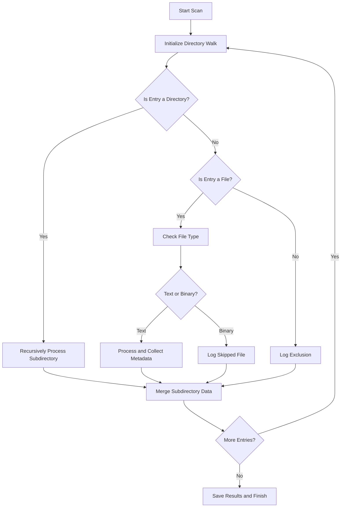

# Project Tools Runner

**Project Tools Runner** is a versatile Tkinter-based desktop application for developers, technical writers, and project managers to streamline project management, analysis, and sharing. It offers a clean, intuitive interface to:

1. **Concatenate Project Files**: Combine all text-based files in your project into a single `.txt` file for easy sharing, backups, or AI code reviews.
2. **Visualize Project Structure**: Map your directory structure into an interactive, multi-column tree view enriched with file metadata like size, creation date, and last-modified date.
3. **Analyze Projects**: Get detailed insights with folder counts, metadata, and advanced filtering options to explore and document your project effortlessly.

This tool is perfect for organizing large codebases, generating documentation, and preparing projects for AI-assisted workflows.

---

## Table of Contents

- [Key Features](#key-features)
- [Installation](#installation)
- [Quick Start](#quick-start)
- [Usage Guide](#usage-guide)
  - [Main Interface](#main-interface)
  - [Project Tree Views](#project-tree-views)
  - [Settings and Controls](#settings-and-controls)
  - [Output Files](#output-files)
  - [Advanced Features](#advanced-features)
- [MCP Server (AI Agent Access)](#mcp-server-ai-agent-access)
  - [What It Is](#what-it-is)
  - [Installation](#mcp-installation)
  - [Running the Server](#running-the-server)
  - [Connecting an AI Client](#connecting-an-ai-client)
  - [Available Tools](#available-tools)
  - [Security Model](#security-model)
- [Technical Details](#technical-details)
  - [Workflow Diagrams](#workflow-diagrams)
  - [File Processing](#file-processing)
  - [Tree Visualization](#tree-visualization)
- [FAQ and Troubleshooting](#faq-and-troubleshooting)
- [Contributing](#contributing)
- [License](#license)

---

## Key Features

### Core Functionality
- **File Loader Tool**: Automatically combines all text-based files into a single `.txt` file while skipping binary files and excluded directories.
- **Project Structure Visualization**: Generates a detailed JSON representation of your directory and displays it in a multi-column, interactive tree view.
- **Snapshot Management**: Save and reload tree states for easy comparison and reference.

### Advanced Features
- **Interactive Controls**: Expand or collapse directories, search by name, filter by file type, and toggle metadata columns (size, created, modified).
- **Copy Tree as Text**: Export the visible tree structure (filtered view) as a clean ASCII representation for documentation or sharing.
- **Partial Collapse**: Collapse the tree to only display top-level directories while preserving current states.
- **Preserved States**: Toggle excluded directories without resetting the tree view.

### User Interface
- **Flexible Layout**: Collapsible tree and console panels, responsive design, and tooltips for intuitive navigation.
- **Console Logging**: Real-time logging for operations, errors, and file processing details.

---

## Installation

### Standard (pip/venv workflow)

1. **Clone the Repository**:
   ```bash
   git clone https://github.com/sidbetatester/AI-Dev-Kit.git
   cd AI-Dev-Kit
   ```

2. **Ensure Python 3.9+** is installed:
   ```bash
   python --version
   ```

3. **Install Tkinter** (Linux users only):
   ```bash
   sudo apt-get install python3-tk
   ```

4. **Optional: Create a Virtual Environment**:
   ```bash
   python -m venv venv
   source venv/bin/activate  # For Windows: venv\Scripts\activate
   pip install -r requirements.txt
   ```

5. **Run the Application**:
   ```bash
   python tool_runner_ui.py
   ```

### Using `uv` (optional, side-by-side with pip)

If you prefer Astral's [`uv`](https://github.com/astral-sh/uv) workflow, the repo now includes a `pyproject.toml` so you can manage dependencies without touching the existing `requirements.txt` flow.

1. **Install uv** (once):
   ```bash
   pip install uv
   # or follow the official install instructions for your platform
   ```
2. **Sync dependencies** (creates an isolated environment managed by uv):
   ```bash
   uv sync
   ```
3. **Run the UI through uv**:
   ```bash
   uv run python tool_runner_ui.py
   ```

Both approaches are supported; choose whichever matches your tooling preference.

---

## Quick Start

1. Open the application and select your **Project Root** using the "Browse..." button.
2. Choose an **Output Directory** (default is `Tools_Outputs`).
3. Select tools to run:
   - File Loader: Concatenates files into a single `.txt`.
   - Project Structure: Visualizes the folder hierarchy.
4. Click **Run Tools** to start processing.
5. Use the tree view to navigate your project or export it as ASCII text.

---

## Usage Guide

### Main Interface


The main window offers:
- **Directory Selection**: Choose the project root and output directory.
- **Tool Selection**: Select File Loader, Project Structure, or both.
- **Excludes Configuration**: Toggle default excludes and edit the comma-separated list of directory names (e.g., `.git`, `venv`, `node_modules`) that are skipped during scans.
- **Output Configuration**: Set file names for concatenated output, structure JSON, and logs.
- **Run Controls**: Start, clear logs, or toggle the console/tree view.

---

### Project Tree Views

#### Full Tree with Metadata


Explore your project with:
- File sizes (bytes).
- Creation and last-modified timestamps.
- Folder counts for directories.

#### Compact Tree View


Switch to a simplified view that focuses on structure alone.

---

### Settings and Controls


Key controls include:
- **Expand All/Collapse All**: Quickly navigate the tree.
- **Search and Filter**: Find specific files or extensions in real time.
- **Snapshot Management**: Save or load the current tree view.
- **Toggle Columns**: Show or hide metadata like size, created, and modified.
- **Show Excluded Dirs**: Control whether directories in the active excludes list are shown in the tree or hidden from view.
- **Persistent Settings**: The excludes checkbox and list are saved between sessions, so your preferred skip rules are restored on restart.

---

### Output Files

1. **Concatenated Text File** (`loaded_files_output.txt`):
   - Contains all text files combined.
   - Skips binary files and excluded directories.

2. **Project Structure JSON** (`project_structure.json`):
   - Hierarchical representation of the project.
   - Includes file metadata and folder relationships.

3. **Log File** (`file_loader_log.txt`):
   - Logs file processing details and errors.

---

### Advanced Features

#### Snapshot Management
- Save snapshots of your project tree and reload them later.
- Export filtered views for team sharing.

#### Copy Tree as Text
- Generate a clean ASCII representation:
  ```plaintext
  Project Tools Runner/
  ├── file_loader.py
  ├── tool_runner_ui.py
  ├── requirements.txt
  └── Tools_Outputs/
      ├── loaded_files_output.txt
      └── project_structure.json
  ```

#### Console Output


Monitor real-time updates:
- File processing status.
- Logs for excluded/skipped files.
- Errors or warnings.

---

## MCP Server (AI Agent Access)

In addition to the desktop UI, the same core file-reading tools can be exposed to an
AI assistant (such as Claude Desktop or an MCP-capable IDE agent) through a local
[Model Context Protocol](https://modelcontextprotocol.io) (MCP) server.

### What It Is

The MCP server (`mcp_server.py`) lets an AI agent call the project's tools directly —
"show me the structure," "read this file," "concatenate this folder" — instead of you
copy-pasting files into a chat. It:

- Runs **entirely on your own machine** as a local program. There is no hosting, no
  account, and no login.
- Communicates with the AI client over **stdio** (a direct pipe between the two
  programs). Nothing is sent over the network and **no data leaves your computer**.
- Is **strictly read-only** — it can list and read files, but never write, delete, or
  execute anything.

It reuses the exact same `FileLoaderTool` and `ProjectStructureTool` as the desktop and
web apps, so the results are identical.

<a id="mcp-installation"></a>
### Installation

The MCP server requires **Python 3.10+** (for the `mcp` SDK) and an extra dependency
file. The core tools themselves still run on Python 3.9+.

```bash
pip install -r requirements.txt -r requirements-mcp.txt
```

> Using `uv`? Install the optional `mcp` extra instead: `uv sync --extra mcp`.

### Running the Server

Point the server at one or more directories it is allowed to read with `--root`
(repeatable). You normally do **not** run this command yourself — your AI client launches
it for you (see the next section) — but you can run it directly to verify it starts:

```bash
python mcp_server.py --root /path/to/your/project
```

Alternatively, set the allowed roots via an environment variable:

```bash
TOOLS_MCP_ALLOWED_ROOTS=/path/to/project python mcp_server.py
```

Useful optional flags: `--exclude NAME` (extra directory name to skip, repeatable),
`--max-files`, `--max-total-bytes`, `--max-file-bytes`, and `--max-depth` to tune the
safety caps. Run `python mcp_server.py --help` for the full list.

### Connecting an AI Client

Your AI client starts the server for you; you just tell it the command to run. For
**Claude Desktop**, add an entry to its `claude_desktop_config.json`:

```json
{
  "mcpServers": {
    "project-tools": {
      "command": "python",
      "args": [
        "/absolute/path/to/mcp_server.py",
        "--root",
        "/absolute/path/to/your/project"
      ]
    }
  }
}
```

Use **absolute paths** for both `mcp_server.py` and each `--root`. Restart the client,
and the tools below will appear automatically. Other MCP-capable clients (Cursor,
Windsurf, VS Code agents, etc.) use the same `command` / `args` shape in their own
config location.

### Available Tools

| Tool | Description |
|------|-------------|
| `list_allowed_roots` | Returns the directories the server is permitted to read. |
| `project_structure`  | Builds the nested folder/file tree (with metadata) for an allowed path. |
| `load_directory`     | Concatenates the text files in an allowed directory. |
| `read_file`          | Returns the contents of a single allowed file. |

### Security Model

Safety is enforced by `mcp_security.py`, independent of the MCP SDK:

- **Allowed-roots jail** — the server can only touch paths inside the directories you
  passed with `--root`. It resolves real paths to block `../` traversal and symlink
  escapes that would point outside those roots.
- **Secret-aware excludes** — sensitive files such as `.env`, `*.pem`, and private keys
  are never returned, even when explicitly requested.
- **Size and depth caps** — limits on file count, total bytes, per-file bytes, and
  directory depth prevent runaway reads.
- **Read-only** — no write, delete, or execute capability exists in any tool.

---

## Technical Details

## File Processing

A short overview of how files are scanned and processed: the tool walks the project tree, detects text vs binary files, extracts metadata, and aggregates results into output files and JSON snapshots.

## Tree Visualization

This section describes the tree visualization output: a multi-column, interactive view that displays directory structure along with file metadata (size, created, modified) and supports filtering and snapshots.

### Workflow Diagrams

#### File Processing Workflow

```mermaid

graph TD
    A[Start Scan] --> B[Initialize Directory Walk]
    B --> C{Is Entry a Directory?}
    C -->|Yes| D[Recursively Process Subdirectory]
    C -->|No| E{Is Entry a File?}
    E -->|Yes| F[Check File Type]
    F --> G{Text or Binary?}
    G -->|Text| H[Process and Collect Metadata]
    G -->|Binary| I[Log Skipped File]
    E -->|No| J[Log Exclusion]
    D --> K[Merge Subdirectory Data]
    H --> K
    I --> K
    J --> K
    K --> L{More Entries?}
    L -->|Yes| B
    L -->|No| M[Save Results and Finish]

```


---

## FAQ and Troubleshooting

### Q: Why is the tree view empty?
- Check if the selected directory contains files.
- Verify that excluded folders (e.g., `venv`, `.git`) are toggled.

### Q: I see "Permission Denied" errors in the console. What should I do?
- Ensure you have read permissions for all files in the project directory.
- Run the app with administrative privileges if needed.

### Q: Can I include binary files in the concatenated output?
- No, binary files are automatically skipped to prevent encoding issues.

---

## Contributing

We welcome contributions! To contribute:
1. Fork the repository.
2. Create a new branch.
3. Implement your feature or fix.
4. Submit a pull request.

---

## License

This project is licensed under the MIT License. See the [LICENSE](LICENSE) file for details.

---

**Author**: [Siddharth Venkumahnati](https://github.com/sidbetatester)  
**Project**: Part of the [AI-Dev-Kit](https://github.com/sidbetatester/AI-Dev-Kit)

> **Project Tools Runner**: Simplifying project management for developers and technical writers. 

---
